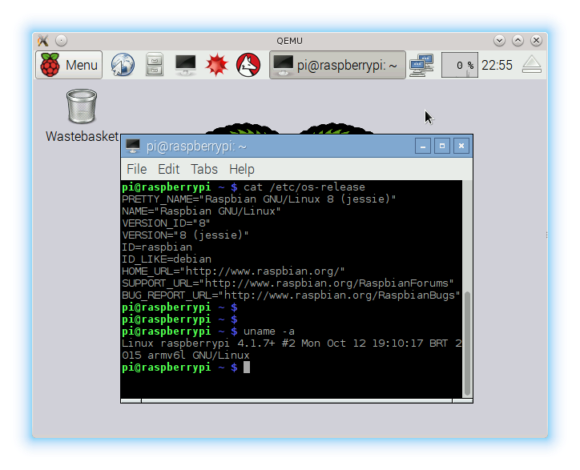

Kernel Build Notes
==================

QEMU ARM Emulator
-----------------

Use the script 'build-kernel-qemu' to build a kernel image that
can be used to boot QEMU.

Script will download kernel 4.1.7 sources and toolchain used to compile it.
A precompiled kernel version is available with the script

Assumptions
-----------

Your system is able to execute 32 bit binaries, and you have git tool

Tests
-----

Tested by booting Raspbian 8 (Jessie) kernel 4.1.7 system in QEMU

You also need to mount raspbian image file and edit /etc/fstab by commenting
out mmcblk entries. also on /etc/ld.so.preload you need to comment out all entries

after that, you can boot iamge using qemu:

qemu-system-arm -kernel kernel-qemu -cpu arm1176 -m 256 -M versatilepb -hda 2015-09-24-raspbian-jessie.img -append "root=/dev/sda2 rootfstype=ext4"

Script and sources modified by Cassiano Martin <cassiano@polaco.pro.br>
